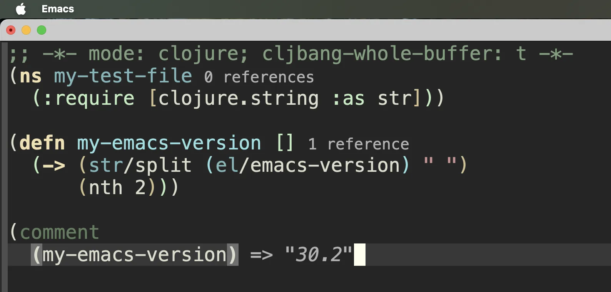

# Cljbang

A Clojure-like language that runs as Emacs Lisp.

> ⚠️ **WARNING**: I'm not sure if any of this is a good idea, but it kinda
> works for me.

Cljbang (`clj!`) compiles Clojure forms to Emacs Lisp forms and evaluates them in the
running Emacs. There is no subprocess, no transpiled text, and no runtime
beyond `cljbang-core.el` itself.

This project is heavily influenced by how I wrote [Squint](https://squint-cljs.github.io/squint/) and adopts its philosophy:

- Embrace the host and its data structures: interop should be first class without transforming between islands
- Light-weight: compilation happens at macro-expansion, so a byte-compiled file costs nothing at load. Uncompiled, about 70ms per 1000 defns.
- Performance first: compiled output should run fast, in the same ballpark as elisp



Which buffers are visiting a file that is no longer there?

```clojure
(defn stale-buffers []
  (->> (el/buffer-list)
       (filter (fn [b] (let [f (el/buffer-file-name b)]
                         (and f (not (el/file-exists-p f))))))
       (map el/buffer-name)))
```

The same thing in Emacs Lisp, which is what it compiles to:

```emacs-lisp
(defun stale-buffers ()
  (let (result)
    (dolist (b (buffer-list) (nreverse result))
      (let ((f (buffer-file-name b)))
        (when (and f (not (file-exists-p f)))
          (push (buffer-name b) result))))))
```

`buffer-list`, `buffer-file-name` and `file-exists-p` are the Emacs
functions you already know, reached through `el/`.

## Installation

Requires Emacs 28.1 or later.

```emacs-lisp
(use-package cljbang
  :vc (:url "https://github.com/borkdude/cljbang.el"))
```

From a clone, put the directory on the load path and require what you
need. `cljbang-mode` pulls in the compiler and the runtime, so it is the
one to ask for if you want inline evaluation:

```emacs-lisp
(add-to-list 'load-path "~/dev/cljbang.el")
(require 'cljbang-mode)

;; then load your own Clojure
(cljbang-load-file "~/.emacs.d/config.clj")
```

Without the editor integration, `(require 'cljbang)` is enough to compile
and load, and `(require 'cljbang-core)` alone is enough to run code that
was byte-compiled earlier.

## Usage

You can use the `clj!` macro directly inside an elisp buffer:

```emacs-lisp
(clj! (defn winner [{:keys [alice bob]}]
        (if (> alice bob) :alice :bob))

      (winner {:alice 3 :bob 5}))
;; => :bob
```

This defines a function straight into your elisp file.

Cljbang gives a better overall feeling when you move the source code to a `.clj` file and then load that file with:

```emacs-lisp
(cljbang-load-file "example.clj")
```

or:

```emacs-lisp
(cljbang-require 'example)
```

The result is cached beside the file as `example.clj.30-0.0.1.elc` and
reused until you edit the source, so this costs about what loading the
equivalent elisp would. The name carries the Emacs and cljbang versions,
so upgrading either rebuilds. Ignore `*.clj.*.elc` in version control.

Then in your `example.clj` just put this line to enable `C-x C-e` to get inline evaluation working:

```clojure
;; -*- mode: clojure; cljbang-whole-buffer: t -*-
```

### Interning

`defn` and `def` intern real elisp symbols, so anything a file defines is
callable from elisp afterwards. Without an `ns` the name is used as is.
An `ns` prefixes it, following the elisp convention: one dash for the
public API, two for internal, which is what `defn-` gives you.

```clojure
;; my_config.clj
(ns my.config)
(defn greet [x] (str "hello " x))
(defn- shout [x] (upcase x))
(def answer 7)
```

```emacs-lisp
(cljbang-load-file "my_config.clj")
(my-config-greet "you")   ;; => "hello you"
my-config-answer          ;; => 7
(my-config--shout "hey")  ;; => "HEY"
```

```clojure
(my.config/greet "you")   ;; from cljbang, reach them with the namespace
(ns my.deep.ns)           ;; dots become dashes: my-deep-ns-name
```


### Require

A `:require` loads a `.clj` file if it finds one, relative to the
requiring file and then along `cljbang-load-path`, and otherwise an elisp
feature of that name. `lib.some-thing` is `lib/some_thing.clj`.

```clojure
(ns my.config
  ;; clj-kondo is right that :as-alias never loads, and wrong that the
  ;; call fails, since Emacs autoloads it. Add this per file, or once in
  ;; .clj-kondo/config.edn.
  {:clj-kondo/config '{:linters {:aliased-namespace-var-usage {:level :off}}}}
  (:require [lib.b :as b]          ;; loads lib/b.clj
            [magit :as m]          ;; loads magit now, about 55ms
            [string :as s]         ;; a built-in prefix, nothing to load
            [org :as-alias o]))    ;; alias only, org loads when called

(b/hello "a")
(o/agenda)                       ;; org loads on this call, not before
(el/magit--display-buffer buf)   ;; internal names need el/
el/org-directory                 ;; void until org loads, variables do not autoload
```

```clojure
(require '[lib.b :as b])   ;; in a file with no ns form
```

```emacs-lisp
(cljbang-require 'lib.b)   ;; from elisp
```

A typo is caught when compiling, since an autoload counts as defined:

```
Warning (cljbang): magti/status resolves to magti-status, which is not defined
```

`cljbang-warn-unresolved` turns that off.

## Interop

Any name cljbang does not define compiles to a plain elisp call:

```clojure
(propertize "hi" 'face 'bold)
(make-overlay (point) (line-end-position))
```

`el/` reaches the host environment explicitly, the way `js/` does in
ClojureScript. Use it for names cljbang shadows, and for elisp names
containing a slash:

```clojure
(el/assoc "b" '(("a" . 1) ("b" . 2)))   ; elisp assoc, not Clojure's
el/tab-width                            ; a variable, not a function
(set! el/my/some-var 42)                ; slash preserved
```

`el` is not a Clojure namespace, and a package reached through
`:as-alias` is never loaded as far as clj-kondo is concerned. Both are
fine here, so in your own `.clj-kondo/config.edn`:

```clojure
{:linters {:unresolved-namespace {:exclude [el]}
           :aliased-namespace-var-usage {:level :off}}}
```

## Standard library

In this section we list the currently supported Clojure-like standard library.

Cljbang has these special forms:

```
def defn defn- defmacro fn let set! if do ns require quote comment
```

Clojure treats only `def`, `if`, `do`, `set!` and `quote` as special. The
rest are macros there, and could become macros here too once there is a
syntax quote to write them with.

### Macros

Cljbang has no syntax quote yet, so build macros
using `list` and `cons`:

```clojure
(defmacro twice [x] (list '+ x x))
(twice 3)                                  ;; => 6

(defmacro unless-neg [n body]
  (list 'if (list '< n 0) nil body))
(unless-neg 5 :ok)                         ;; => :ok
```

These ship as macros rather than compiler support:

```
when cond -> ->> with-out-str time
```

### Functions

Supported functions:

```
+ - * / mod = not= < > <= >= inc dec not odd? even? zero?
first second rest nth count get contains? conj assoc
map filter reduce str pr-str println prn name subs
re-pattern re-find re-matches re-seq
hash-map hash-set load-file
```

`clojure.string`, aliased to `str` out of the box, so `clj!` needs no
require for it:

```
join split split-lines replace blank? includes? starts-with? ends-with?
index-of last-index-of upper-case lower-case capitalize reverse
trim triml trimr trim-newline
```

```clojure
(str/join ", " ["a" "b"])   ;; => "a, b"
```

`str` is the only alias predefined. Any other alias comes from a
`:require`, which also means `clj!` cannot use one, having no ns form.

Map and set literals, destructuring (sequential and associative, nested,
in `let` and in fn params), and sets, maps, keywords and vectors called as
functions.

```clojure
(#{1 2 3} 1)                ;; => 1
(:a {:a 1})                 ;; => 1
(filter #{1 3} [1 2 3 4])   ;; => (1 3)
```

Regex literals, which are elisp regexps rather than Java ones, so groups
and alternation are spelled `\\(` and `\\|`:

```clojure
(re-find #"a+" "baaac")                    ;; => "aaa"
(re-seq #"a." "abac")                      ;; => ("ab" "ac")
(str/replace "a1b2" #"[0-9]" "#")          ;; => "a#b#"
(str/replace "a.b" "." "!")                ;; => "a!b", a string match is literal
```

Anonymous function literals, with `%`, `%1`, `%2` and `%&`:

```clojure
(map #(+ % 1) [1 2 3])      ;; => (2 3 4)
(#(list %1 %&) 1 2 3)       ;; => (1 (2 3))
```

## Differences from Clojure

Host semantics win where they conflict, unless otherwise noted, like in Squint.

```clojure
(/ 1 2)             ;; => 0, elisp division, no ratios
(nth "abc" 0)       ;; => 97, characters are integers
(if (list) :y :n)   ;; => :n, elisp has no empty list distinct from nil
(if [] :y :n)       ;; => :y, and 0, "" and {} are true as in Clojure

#"\\(a\\|b\\)"       ;; elisp regex syntax, where Clojure writes #"(a|b)"
(assoc m :k 1)      ;; copies the map, so O(n)
```

Inside `clj!` there is no source text to rewrite, so use `hash-set` and
`fn`, or move the code to a `.clj` file:

```clojure
(clj! #{1 2})       ;; read error
(clj! (hash-set 1 2))
```

Not implemented (currently):

- syntax quote, so macros build expansions with `list` and
`cons`. `:strs`, `:syms` and namespaced `:keys`.
- Protocols and multimethods.

## Benchmarks

This is a casual benchmark done on my local machine with Emacs 30.2 and 1000 `defn`s. You can reproduce it with `bb bench-load`
and `bb bench`.

| loading | |
|---|---|
| `cljbang-load-file`, cold cache | 157 ms |
| `cljbang-load-file`, warm cache | 1.9 ms |
| byte-compiled plain elisp | 1.0 ms |

| calling all 1000 | |
|---|---|
| cljbang | 0.40 ms |
| plain elisp | 0.36 ms |

Compiled output is plain elisp, so once the cache is warm the overhead is
about a millisecond at load and ten percent at run time. Collection code
is further off, since `map` and `filter` dispatch through a wrapper and
`assoc` copies.

## Test

```
bb test
bb compile
```

## License

MIT
